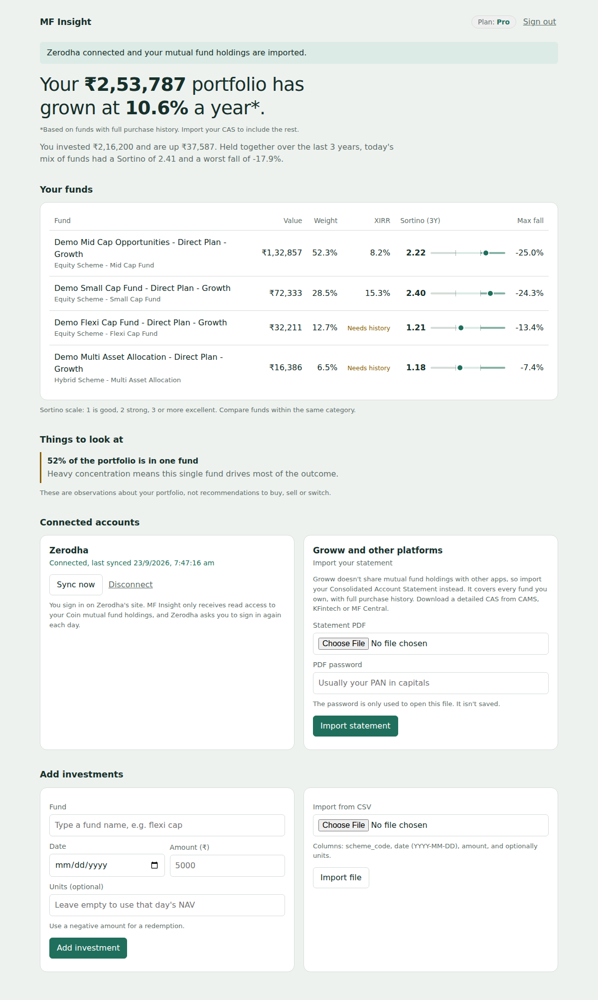

# MF Insight — AI mutual fund portfolio intelligence (subscription SaaS)

Working MVP: analytics engine + API + web dashboard + subscription tiers.



## Run it
```bash
pip install -r requirements.txt
python -m pytest -q                       # 27 tests

# Demo mode: 6 simulated funds, no network needed
MF_OFFLINE=1 uvicorn app.main:app --reload

# Live mode: every AMFI scheme, real NAVs from mfapi.in
BENCHMARK_CODE=<nifty50_index_fund_scheme_code> uvicorn app.main:app --reload
```
Open http://127.0.0.1:8000, create an account, add investments.
Windows PowerShell: `$env:MF_OFFLINE="1"; uvicorn app.main:app --reload`

Engine-only demo: `python demo.py --offline` or `python demo.py <scheme_code>`.
Find scheme codes: `https://api.mfapi.in/mf/search?q=<fund name>`

## Development workflow

```bash
make install   # dependencies + linter
make test      # 27 tests on demo data (no network, no secrets)
make lint      # catches unused imports and undefined names
make demo      # app with simulated funds
make run       # app with live data, settings from .env (copy .env.example)
```
Windows without `make`: run the command shown under each target in the `Makefile`.

Every push to `main` and every pull request runs lint + tests on Python 3.11 and 3.12
via GitHub Actions (`.github/workflows/ci.yml`). Dependabot opens weekly PRs for
dependency updates, and CI tests each one before you merge.

Suggested flow: create a branch per change → push → open a PR → merge when CI is green.

Docker: `docker build -t mf-insight . && docker run -p 8000:8000 --env-file .env -v mfdata:/data mf-insight`

## Broker connections

| Platform | How | What you get |
|---|---|---|
| Zerodha | Kite Connect OAuth ("Connect Zerodha") | Current units + average price for Coin MF holdings; re-sync any time the daily session is valid |
| Groww | CAS statement import | Groww's official API covers stocks and F&O only, so Groww funds come in via CAS — with full purchase history |
| Any other platform | CAS statement import | Same as Groww |

### Zerodha setup
1. Create an app at developers.kite.trade (paid Kite Connect app to serve other users;
   the free Personal app only works for your own account).
2. Set its redirect URL to `http://127.0.0.1:8000/api/brokers/zerodha/callback`
   (your real domain in production, HTTPS).
3. Run with `KITE_API_KEY=... KITE_API_SECRET=... TOKEN_KEY=...`.
   `TOKEN_KEY` encrypts stored access tokens; generate with
   `python -c "from cryptography.fernet import Fernet; print(Fernet.generate_key().decode())"`.

In demo mode (`MF_OFFLINE=1`), "Connect Zerodha" uses a fake broker so the full flow works without credentials.

### How synced data is reconciled (`app/sync.py`)
- First sync of a fund with no history → one opening-balance record (units × average price).
  Value and gain are exact; XIRR shows "Needs history" until a CAS import supplies dates.
- Later syncs → unit differences are recorded on the sync date at that day's NAV.
- CAS import is authoritative: it replaces broker estimates for the same funds, and re-importing never double counts.

## Automatic statement import (Groww and every platform)

Investors receive a consolidated statement by email after months with
transactions. MF Insight picks these up two ways; both use the statement
password the user chooses to save (encrypted, with an explicit consent tick).

**Gmail connection** (`app/mail/gmail.py`, `app/routes_mail.py`)
1. Google Cloud Console → create a project → enable the Gmail API.
2. OAuth consent screen → External → add scope `gmail.readonly` → add yourself
   (and up to 100 testers) as test users. Leave it in **Testing** mode.
3. Credentials → OAuth client ID (Web) → redirect URI
   `http://127.0.0.1:8000/api/mail/gmail/callback`.
4. Run with `GOOGLE_CLIENT_ID=... GOOGLE_CLIENT_SECRET=...`.

Only emails matching the statement search (senders in `STATEMENT_SENDERS`, or the
subject "Consolidated Account Statement", with a PDF) are read. Public launch needs
Google app verification plus an annual security assessment for this restricted scope.
Testing-mode refresh tokens expire after 7 days, so testers reconnect weekly.

**Forwarding address** (no inbox access)
- Each user gets `<token>@$INBOUND_DOMAIN`. Point an inbound-email service
  (Mailgun Routes, SendGrid Inbound Parse, Postmark, Cloudflare Email Workers)
  at `POST /api/inbound/email` with header `X-Inbound-Secret: $INBOUND_SECRET`.
- Gmail's forwarding confirmation code is captured and shown in the app.
- Only PDFs from statement senders are processed; everything else is ignored.

**Scheduled check:** `python -m app.jobs check-mail` (e.g. daily cron).

Imports are additive and de-duplicated (`app/statements.py`): monthly statements add
new transactions without removing older history, and the same statement never imports twice.

## What's built
| Module | Does |
|---|---|
| `app/main.py` | FastAPI: register/login, fund search, add/delete/CSV-import transactions, portfolio summary, per-fund metrics (Pro-gated, returns 402 on Free), dev plan switch |
| `app/plans.py` | Plan definitions + `require(user, feature)` entitlement checks; paid plans lapse to Free after `plan_valid_until` |
| `app/auth.py` | PBKDF2 password hashing, opaque bearer tokens |
| `app/navs.py` | Live AMFI/mfapi provider or offline demo funds; NAV-on-date for deriving units |
| `app/routes_brokers.py` | Zerodha login/callback/sync/disconnect, CAS import endpoint, broker status |
| `app/brokers/zerodha.py` | Kite Connect client (token exchange with checksum, `/mf/holdings`), offline fake |
| `app/sync.py` | Broker holdings → transactions reconciliation |
| `app/cas.py` | CAS PDF parsing via `casparser`, transaction mapping |
| `app/statements.py` | Shared import pipeline: parse, de-duplicate, record automatic import outcomes |
| `app/routes_mail.py` | Statement password, Gmail connect/check/disconnect, inbound-email webhook |
| `app/mail/gmail.py` | Gmail OAuth, refresh, statement search, PDF attachment download, offline fake |
| `app/jobs.py` | Cron entry point for daily Gmail checks |
| `app/secrets_box.py` | Fernet encryption for stored broker tokens |
| `app/static/index.html` | Dashboard: portfolio summary, holdings with Sortino scale, insights, add/import, plans |
| `metrics.py` | CAGR, volatility, downside deviation, Sharpe, Sortino, beta, Jensen's alpha, up/down capture, max drawdown (with peak/trough/recovery dates), rolling 3Y returns, XIRR |
| `nav_source.py` | AMFI daily NAV file parser (scheme master + categories), mfapi.in history, disk cache |
| `portfolio.py` | Holdings from transactions, portfolio & per-scheme XIRR, weights, risk of current allocation, stock overlap, health checks |

Conventions: monthly returns, 3-year lookback, annual risk-free rate converted
to monthly (default 6.5%, make it configurable from T-bill yields). Values will
differ slightly from Value Research / Morningstar because each uses its own
conventions — show your methodology on a "How we calculate" page.

## Target architecture
```
                ┌──────────── Web app (Next.js/React) ────────────┐
                │ dashboard · fund pages · AI chat · billing page │
                └───────────────┬─────────────────────────────────┘
                                │ REST
                ┌───────────────▼────────────────┐
                │ API (Spring Boot or FastAPI)   │── Razorpay/Cashfree subscriptions
                │ auth · plans · entitlements    │   (webhooks -> plan status)
                └──┬──────────────┬──────────────┘
                   │              │
     ┌─────────────▼───┐   ┌──────▼──────────────┐    ┌───────────────────┐
     │ Analytics svc   │   │ AI layer            │    │ Jobs (cron)       │
     │ (this repo)     │   │ LLM explains numbers│    │ 23:00 AMFI NAVs   │
     │ metrics,        │   │ it is GIVEN; never  │    │ monthly: AMC      │
     │ health checks   │   │ computes them       │    │ holdings, category│
     └────────┬────────┘   └─────────┬───────────┘    │ medians, reports, │
              │                      │                │ alerts            │
     ┌────────▼──────────────────────▼────────────────┴───────────────────┐
     │ Postgres: users, plans, transactions, holdings, nav_history,       │
     │ fund_metrics (precomputed daily), category_medians, stock_holdings │
     └────────────────────────────────────────────────────────────────────┘
```
Portfolio import: CAS PDF upload (CAMS/KFintech/MF Central) → parser →
transactions. Password-protected PDFs: user enters the password in the upload
form; never store it.

## Subscription enforcement
Store `plan` + `valid_until` on the user, updated only by payment-gateway
webhooks (verify signatures). Every API endpoint checks an entitlement table:

| Feature | Free | Pro | Premium |
|---|---|---|---|
| Portfolio returns & XIRR | ✓ | ✓ | ✓ |
| Per-fund advanced ratios vs category | portfolio only | ✓ | ✓ + history |
| AI chat questions / month | 3 | 50 | 200 |
| Monthly AI report, alerts | – | ✓ | ✓ |
| Family members | 1 | 1 | 5 |

## Compliance guardrails (keep these in code, not just policy)
- Health checks and AI output are observations, not buy/sell/switch instructions.
- LLM system prompt forbids recommendations; add an output filter for phrases
  like "you should sell/buy/switch".
- Get alert and report wording reviewed by someone who knows SEBI regulations.

## Roadmap
1. ✅ Analytics engine
2. ✅ API, auth, entitlements, dashboard, CSV import (MVP)
3. ✅ Zerodha connection + CAS import (Groww and all platforms)
3b. ✅ Automatic statement import: Gmail (testing mode) + forwarding address
4. Razorpay/Cashfree subscriptions (replace `/api/billing/dev-activate` with webhooks)
5. Daily NAV history store (save AMFI file nightly) + precomputed fund metrics
6. Category medians & quartiles → "below category median" insights
7. AMC monthly holdings parser → overlap insights
8. Move SQLite → Postgres, Docker Compose deploy
9. AI layer: monthly report + chat grounded on computed metrics
10. Alerts (ratio drops, manager change, quartile slip)

## Known MVP limits
- Units are derived from the NAV on the transaction date if not given; stamp
  duty and exit loads are ignored until the CAS parser supplies exact units.
- App sessions never expire yet; add expiry before going public.
- Kite access tokens last until ~6 AM the next day and can't be refreshed, so syncing
  needs the user to reconnect. Daily NAV-based values keep updating regardless.
- Coin MFs sit in demat, and a CAMS/KFintech CAS may not include demat holdings (a CDSL/NSDL
  CAS does). If a user imports a CAMS CAS and also syncs Zerodha for the same fund, check units.
- CAS parsing is tested against casparser's data shape, not yet against a real statement.
- Statement sender domains are best guesses; check the From address on your real
  statement emails and adjust `STATEMENT_SENDERS` if needed.
- Depository (NSDL/CDSL) statements list demat holdings; the importer currently reads
  only the mutual fund folio section.
- Live mode fetches NAV history on first use of each fund (cached 12h on disk).
